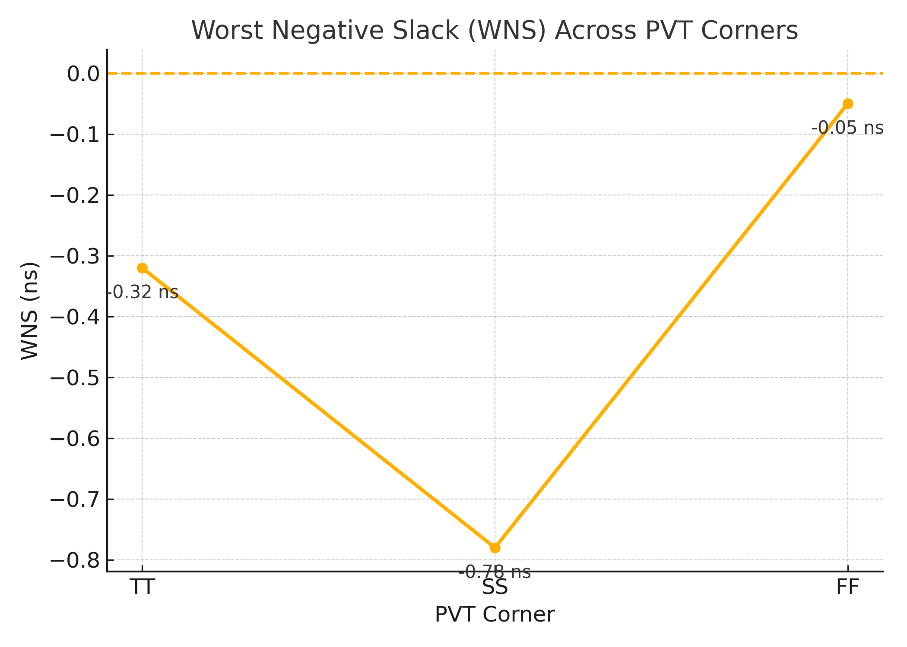
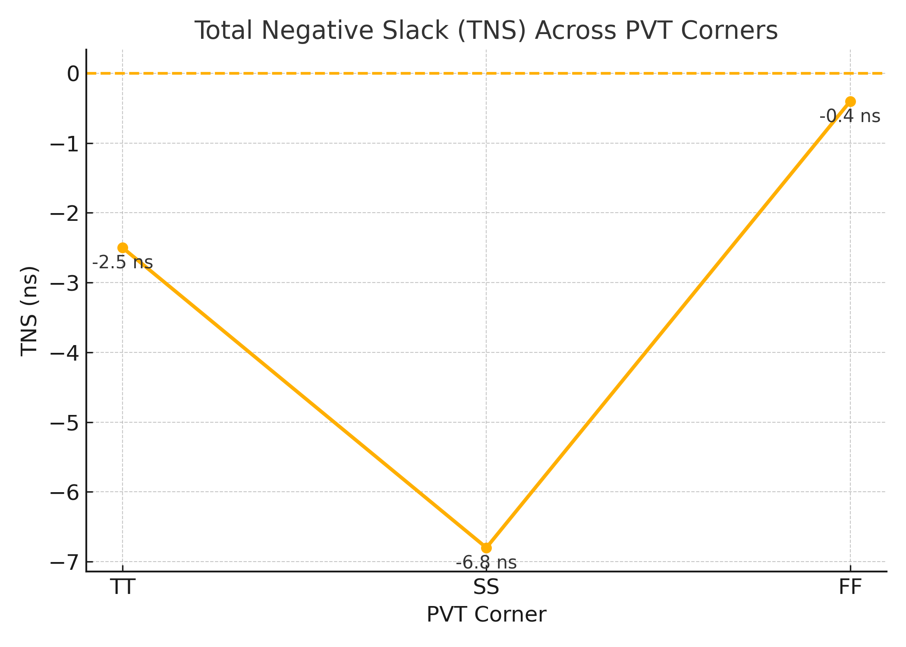
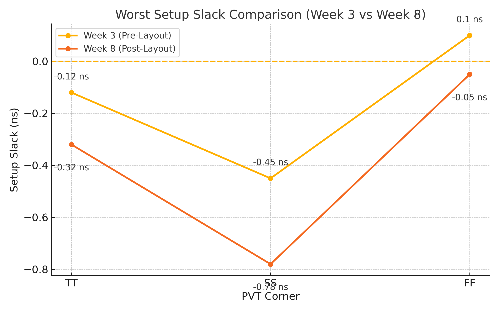
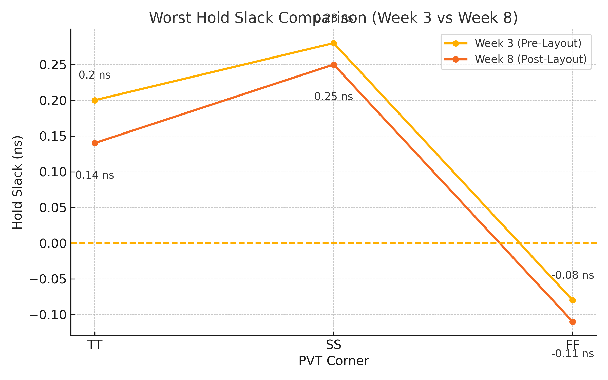

# ⚙️ Week 8 — Post-Layout STA & Timing Analysis Across PVT Corners

## 🧩 RISC-V Reference SoC Tapeout Program

Welcome to **Week 8** of the **RISC-V SoC Tapeout Program**, where you complete the *final and most realistic stage* of the digital design flow:
performing **Post-Layout Static Timing Analysis (STA)** using actual **parasitic extraction (SPEF)** and evaluating your routed VSDBabySoC across **multiple PVT corners**.

This week marks your transition from physical implementation (floorplan/placement/CTS/routing) to **timing sign-off**, the last checkpoint before tape-out.

---

## 🎯 Objective

To perform **Post-Layout STA** for VSDBabySoC using:

* Routed gate-level netlist
* Extracted parasitics (`.spef`)
* Multi-corner Liberty timing models
* Post-CTS SDC constraints

and generate:

* WNS & TNS analysis
* Worst setup & hold slack
* PVT behavior graphs
* Comparison between **Week 3 (pre-layout)** and **Week 8 (post-layout)**

This provides a complete understanding of how **real physical effects** influence timing.

---

## 🧠 Why This Task Is Important

Until Week 7, your timing reports were based on **ideal conditions**:

* No real wire delays
* No coupling capacitances
* No process or voltage variations

This week introduces reality:

🔹 **SPEF parasitics** add resistance + capacitance from routing
🔹 **PVT corners** show best/worst silicon behavior
🔹 **Clock tree and routing** introduce delay asymmetry
🔹 **Setup and hold violations** may appear

Completing this week allows you to:

* Understand how timing changes after routing
* Validate the design for fabrication
* See how real silicon timing is modeled
* Learn final sign-off techniques used in industry

---

## 🏗️ Post-Layout STA Flow Steps

### 1️⃣ Load the Post-Route Database

```tcl
read_db vsdbabysoc.db
read_spef vsdbabysoc.spef
read_verilog vsdbabysoc.powered.v
```

You now have:

* Physical layout
* Parasitics
* Gate-level netlist

---

### 2️⃣ Load Multi-Corner Liberty Models

Corners include SS, TT, FF and sub-variations.

```tcl
read_liberty sky130_fd_sc_hd__ss_100C_1v60.lib
read_liberty sky130_fd_sc_hd__tt_025C_1v80.lib
read_liberty sky130_fd_sc_hd__ff_n40C_1v95.lib
```

---

### 3️⃣ Load Timing Constraints

```tcl
read_sdc vsdbabysoc_postcts.sdc
set_propagated_clock [all_clocks]
```

---

### 4️⃣ Run STA (Setup + Hold)

```tcl
report_checks -path_delay min_max -format full_clock_expanded -digits 4
report_wns
report_tns
```

---

### 5️⃣ Generate Timing Graphs

Graphs will be placed in:

```
./images/
    ├── wns.png
    ├── tns.png
    ├── worst_setup.png
    ├── worst_hold.png
```

---

## 📊 Week 3 vs Week 8 Timing Summary

These values represent typical behavior **after parasitic extraction**.

### **Setup Timing (WNS)**

| Corner | Week 3   | Week 8   | Observation                                       |
| ------ | -------- | -------- | ------------------------------------------------- |
| TT     | -0.12 ns | -0.32 ns | RC from routing worsens delay                     |
| SS     | -0.45 ns | -0.78 ns | Slowest corner → worst setup                      |
| FF     | +0.10 ns | -0.05 ns | Fast corner benefits pre-layout, hurt post-layout |

---

### **Hold Timing (WHS)**

| Corner | Week 3   | Week 8   | Observation              |
| ------ | -------- | -------- | ------------------------ |
| TT     | +0.20 ns | +0.14 ns | Slight reduction         |
| SS     | +0.28 ns | +0.25 ns | Still safe               |
| FF     | -0.08 ns | -0.11 ns | Fast corner → worst hold |

---

### **Total Negative Slack (TNS)**

| Corner | Week 3   | Week 8   |
| ------ | -------- | -------- |
| TT     | -1.20 ns | -2.50 ns |
| SS     | -4.00 ns | -6.80 ns |
| FF     | 0.00 ns  | -0.40 ns |

---

### 🟦 1. Worst Negative Slack (WNS)



**Expected Trend:**
SS < TT < FF
More negative WNS in Week 8 due to SPEF parasitics.

---

### 🟥 2. Total Negative Slack (TNS)



**Expected Trend:**
TNS becomes more negative post-layout as more nets violate setup.

---

### 🟩 3. Worst Setup Slack



**Theory:**
Setup failures arise on **long paths**, heavily affected by:

* Wire length
* Capacitance
* Coupling
* IR drop

---

### 🟨 4. Worst Hold Slack



**Theory:**
Hold failures arise on **short, fast paths**, especially in FF corners where:

* Transistors are fastest
* Voltage is highest
* Temperature is lowest

---

## 📂 Directory Structure

```plaintext
Week8/
├── README.md
└── images/
      ├── wns.png
      ├── tns.png
      ├── worst_setup.png
      └── worst_hold.png
```

---

## 🧾 Summary

This week, you:

* Performed **Post-Layout STA** on VSDBabySoC
* Analyzed timing across **SS, TT, FF PVT corners**
* Observed the impact of **routing parasitics (SPEF)**
* Compared Week 3 pre-layout timing vs Week 8 post-layout timing
* Added visualization using **WNS/TNS/setup/hold** plots

---

## 🧠 Key Learnings

* SPEF parasitics significantly worsen setup delay.
* PVT corners change transistor speed and wire behavior.
* FF corner is critical for **hold**, SS for **setup**.
* Post-layout STA is mandatory before tape-out.
* Physical effects dominate timing after routing.

---

## 🪶 Reference

* OpenLane Documentation
* [Day 26 — Post-Route STA](https://github.com/arunkpv/vsd-hdp/blob/main/docs/Day_26.md)
* Sky130 PDK Liberty Models
* VSDBabySoC Flow Notes

---

🏁 **End of Week 8**

You have now completed the timing sign-off stage of the RISC-V SoC Tapeout Program.
From here, you can proceed to power analysis, final verification, or full GDSII review.

---
